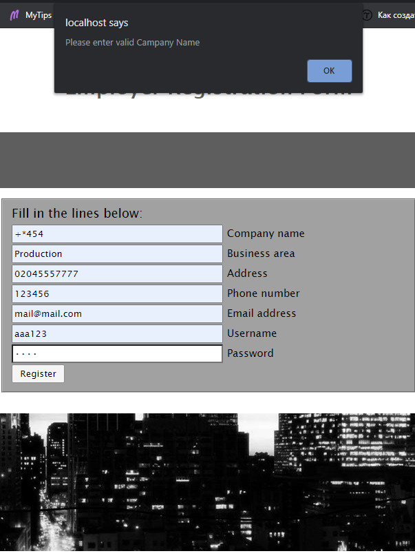

# JS-Online-Web-site (Direct link: http://jsonline.rf.gd)

Welcome to my “JS Online” WebSite. The main purpose of which is Job search. So Employers can register their organizations here and create the jobs and employers can search them. All is simple like that. 

## 1. Here is brief guide of using the WebSite:
## 1) If you are Organization, please create your own account by pressing on the Registration button

## 3. With working Database (PHP as a backend language)

## 4. Allows users to Register, Login, Create new Job Advertisments and leave a feedback

## 5. Maintain a Session

## 6. JavaScript For form validation

