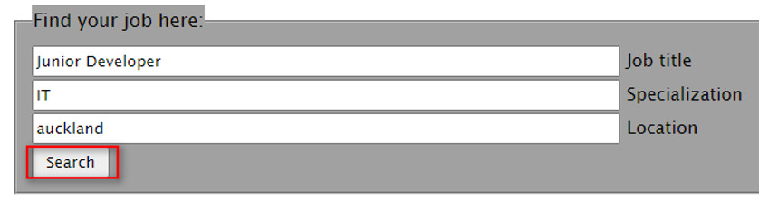

# JS-Online-Web-site (Direct link: http://jsonline.rf.gd)

Welcome to my “JS Online” WebSite. The main purpose of which is Job search. So Employers can register their organizations here and create the jobs and employers can search them. All is simple like that. Here is brief guide of using the WebSite:

## 1) If you are an Organization, please create your own account by pressing on the Registration button

## 2) Type in your Organization details in this table. All forms have validation parameters, so please remember to use “real-like” data. Remember your Username and Password

## 2.5) Here you can see the MySQL database with table “employer” and new data inserted.

## 3) When the registration is over you can Login by using your Personal Data

## 4) If registration was successful you will see this line in the top left corner of the screen.

## 5) Now, when you authorized you can create the new Job, please press the “Add Advertisement” button.

## 6) Now you can create your new Job Advertisement. Please remember that all forms have validation parameters, so please use “real-like” data.

## 7) Here you can see the MySQL database with table “job” and new data inserted.

## 8) If you are an Employee and want to find the certain Job, you can use the “Job Search” button.

## 9) Please insert the Job Title. Specialization and Location

## 10) If the system has the Job for you it will show you that.

